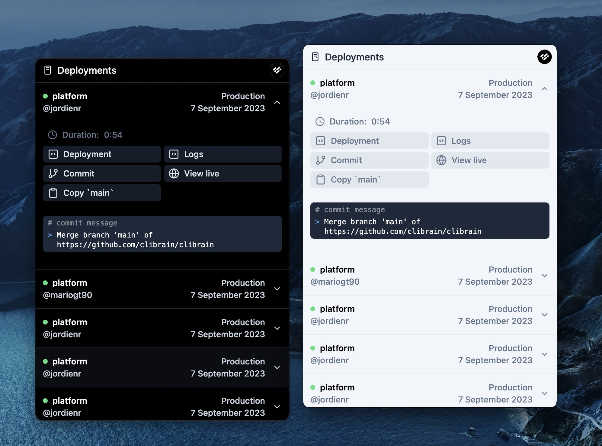

# Vercel Menubar

An open source menubar app for Vercel ▲

## Features

- [x] Add multiple Access Tokens in case you have multiple Vercel accounts
- [x] Change between teams
- [x] List all deployments for a team
- [x] Shortcuts to open deployments in browser
- [x] Light and Dark mode
- [] Auto updates
- [] Notifications for new or failed deployments
- [] Gitlab and Bitbucket support

## Special Thanks

- [Vercel](https://vercel.com) for the amazing platform and API.
- [Electron React Boilerplate](https://github.com/electron-react-boilerplate/electron-react-boilerplate) for the boilerplate.
